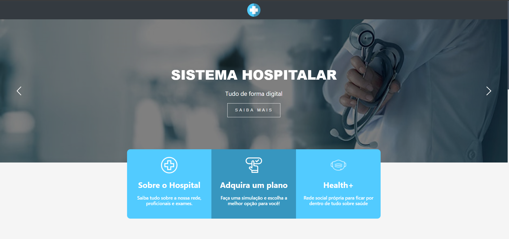

# Hospital System

## Sobre o projeto

<h1 align="center">
  
</h1>
Projeto de um site de gerenciamento de uma rede de hospitais. Possui 3 módulos: Administradores, Médicos e Pacientes, além de um sistema de ecommerce. 
Cada módulo possui sua respectiva regra de négocio e sistemas baseados na necessidade de cada usuário. Possui também um pequeno sistema de rede social chamado Health+,
cujo objetivo principal é conectar os médicos presentes na rede hosptialar com os pacientes, e aproximar mais os administradores de ambos usuários afim de que eles
entendam as necessidades e problemas de ambos. 

<h4 align="center"> 
	🚧  Status do projeto: 🛠 Em desenvolvimento...  🚧
</h4>

## Tabela de conteúdos

<!--ts-->
   * [Sobre](#sobre-o-projeto)
   * [Tabela de Conteudo](#tabela-de-conteúdos)
   * [Pré Requisitos](#pré-requisitos)
   * [Versões](#versões)
   * [Instalação](#instalação)
   * [Padrão de projeto](#padrão-de-projeto)
   * [Como usar cada módulo](#padrão-de-projeto)
      * [Administradores](#pre-requisitos)
      * [Médicos](#medicoss)
      * [Pacientes](#pacientes)
      * [E-commerce](#e-commerce)
      * [Healht+](#health+)
    
   * [Tecnologias](#tecnologias)
   * [Autor](#autor)
<!--te-->

## Pré Requisitos

  - Instalar o pacote do XAMPP
  - Instalar o composer
  - Instalar o npm e node
  
## Versões
      XAMPP Version: 7.4.21
      Composer version 2.1.3 2021-06-09 16:31:20
      npm 6.14.13
      node v14.17.3

## Instalação

Se você já possui todos os pré requisitos listados, pode clonar este repositório para sua pasta local, pode ser em qualquer parte do seu computador, 
não é necessário que seja clonado no htdocs do xampp, pois iremos posteriormente configurar uma porta para o servidor local.

 🧭 Rodando o Backend (servidor)
 
   Você deve abrir o diretório principal do projeto pelo terminal ir até o sub-diretório "public"  para configurar a porta, seguindo os seguintes comandos

      # Clone este repositório
      $ git clone https://github.com/vitoriamatos/Hospital-System.git
      
      # Acesse a pasta do projeto no terminal/cmd e em seguida acesse o subdiretorio public
      $ cd public
      
      # Coloque o comando para iniciar o servidor configurando na porta 8080
      - php -S localhost:8080
      
      # O servidor inciará na porta:8080- acesse http://localhost:8080

  🎲 Configurando o banco de dados
 
 	* Ao clonar o projeto , verifique que na pasta principal está um arquivo chamado hospital-system.sql
	* Em seguida digite em seu navegador http://localhost/phpmyadmin
	* No Dashboard lateral esquedo, clique no botão "NOVO"
	* Defina o nome como sendo hospital-system e escolha o padão UTF8_GENERAL_CI
	* Clique em importa banco de dados, e vá até onde está localizado o arquivo hospital-system.sql
	
	
 ## Padrão de Projeto
 
 Foi utilizado o padrão de arquitetura MVC, bem como os conceitos de POO. Além disso, também foi utilizado o trello para um melhor controle das atividades a serem feitas 
 e das já realizadas. 
 
 ⚠️ obs.: Posteriormente será anexado os arquivos do modelo de uml do projeto 
 
 
 ## Como usar cada módulo
 
 - Administradores
 
Os administradores possuem a função de criar novos usuários e monitorar todo o sistema. É função dele  aprovar todas as solicitações vindas do ecommerce, para posteriormente e criar novos pacientes. Faz  parte da regra de negócios desse projeto, a finalização do plano ser feita pelo administrador. 
 
 Pode também criar novos médicos, administradores e é nesse módulo que se é iniciado a triagem de pacientes do pronto socorro. Além de poder monitorar os status do sistema de urgencia, através de paineis e gráficos que funcionam como contadores.
 
 - Médicos 
 
 Os médicos podem abrir o relatório de Pronto Socorro, previamente criado pelos adms e realizar o atendimento do paciente. Podem editar suas próprias informações e buscar por pacientes na urgencia.
 
 - Pacientes
 
 Os pacientes podem solicitar agendamento de exames, desmarcar ou remarcar, pofrm também verificar seu histórico hospitalar e editar suas informações. 
 
 - Ecommerce
 
  Faz a venda de algum pacote de plano, e da inicio a criação de um usuário paciente, iniciando uma lista de oportunidades que são monitoradas pelos adms, que irão concluir 
  esse processo. 
 
 
 ## Tecnologias
 
 As seguintes ferramentas foram usadas na construção do projeto:
 * Frontend:
 	* HTML
 	* CSS/SCSS
 	* Less
 	* JS
*  Backend
	* PHP

* Banco de dados
	* MySQL
 
 ## Autor

 <b>Maria Vitória</b></a> 
  

 

  
